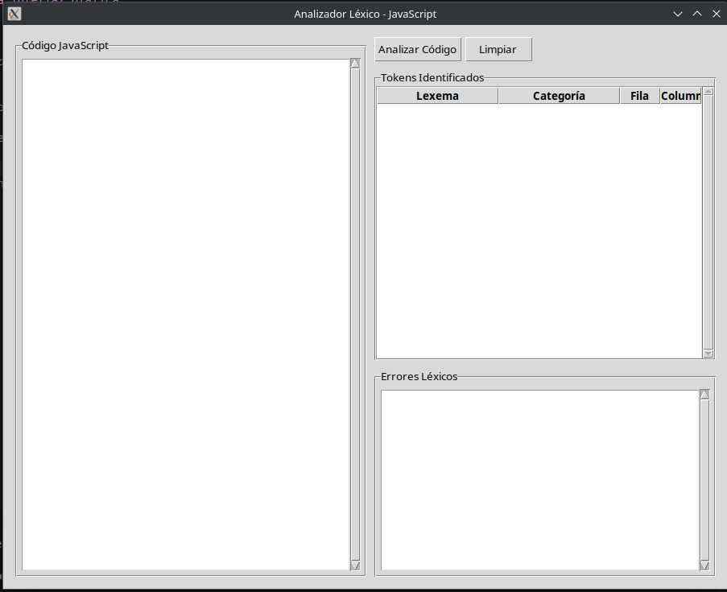

# Documentación del Analizador Léxico de JavaScript

Este directorio contiene la documentación completa del proyecto de analizador léxico para JavaScript.

## Contenido

- [Documentación de Autómatas](automatas/README.md): Descripción formal de todos los autómatas finitos deterministas implementados, incluyendo expresiones regulares y diagramas de estados.
- [Requisitos Cumplidos](requisitos_cumplidos.md): Detalle de cómo el proyecto cumple con todos los requisitos especificados.

## Capturas de pantalla

Para obtener capturas de pantalla de la interfaz gráfica, ejecute la aplicación con el comando:

```bash
python3 main.py
```

Y capture la ventana que aparece. La interfaz del analizador léxico se ve así:



## Guía de uso

1. Escriba código JavaScript en el editor de la izquierda
2. Haga clic en el botón "Analizar Código"
3. Revise los tokens identificados en la tabla superior derecha
4. Si hay errores léxicos, aparecerán en el panel inferior derecho

## Tokens reconocidos

El analizador léxico reconoce los siguientes tipos de tokens:

- Identificadores: nombres de variables, funciones, etc. (limitados a 10 caracteres)
- Números Naturales: secuencias de dígitos
- Números Reales: con punto decimal y/o notación científica
- Palabras Reservadas: var, let, const, if, else, etc.
- Cadenas de Caracteres: con comillas dobles, simples o acentos graves
- Comentarios: de línea (//) y de bloque (/* */)
- Operadores: aritméticos, de comparación, lógicos, de asignación, etc.
- Delimitadores: paréntesis, llaves, corchetes, punto y coma, etc.

## Detección de errores

El analizador detecta los siguientes tipos de errores léxicos:

1. Caracteres no reconocidos: símbolos que no pertenecen al lenguaje JavaScript
2. Cadenas de texto sin cerrar: cadenas que comienzan con comillas pero no terminan
3. Comentarios de bloque sin cerrar: comentarios que comienzan con /* pero no terminan con */ 