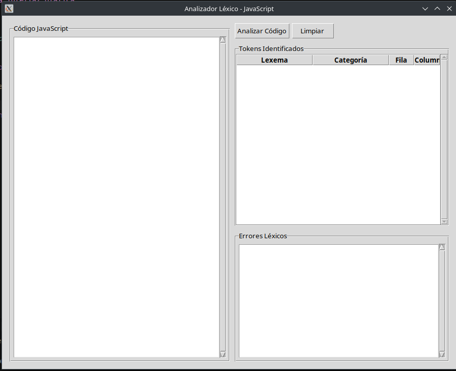

# Documentación de Autómatas Finitos Deterministas (AFD)

Este directorio contiene la documentación formal de cada uno de los autómatas finitos deterministas implementados para el analizador léxico de JavaScript.

## Índice de Autómatas

1. [Identificadores](identificador.md) - Reconoce nombres de variables, funciones, clases (limitados a 10 caracteres)
2. [Números Naturales](numero_natural.md) - Reconoce números enteros positivos
3. [Números Reales](numero_real.md) - Reconoce números con punto decimal y notación científica
4. [Palabras Reservadas](palabra_reservada.md) - Reconoce palabras clave del lenguaje JavaScript
5. [Cadenas de Caracteres](cadena.md) - Reconoce cadenas delimitadas por comillas (simples, dobles o acentos graves)
6. [Comentarios de Línea](comentario_linea.md) - Reconoce comentarios que comienzan con //
7. [Comentarios de Bloque](comentario_bloque.md) - Reconoce comentarios delimitados por /* y */
8. [Símbolos y Operadores](simbolo.md) - Reconoce operadores, delimitadores y otros símbolos especiales

## Estructura de la Documentación

Para cada autómata, se proporciona:

- **Expresión Regular**: La expresión formal que describe el patrón del token
- **Descripción del Autómata**: Explicación de los estados y transiciones
- **Diagrama**: Representación gráfica del autómata
- **Implementación**: Detalles sobre cómo se ha codificado el autómata

## Métodos comunes

Todos los autómatas implementan un método `analizar(texto, pos_inicial)` que:

1. Recibe un texto y una posición inicial
2. Intenta reconocer un token válido a partir de esa posición
3. Devuelve una tupla con tres elementos:
   - `es_valido`: Booleano que indica si se encontró un token válido
   - `lexema`: El token encontrado (cadena vacía si no se encontró)
   - `caracteres_consumidos`: Número de caracteres procesados

## Restricciones de Implementación

- Ningún autómata utiliza expresiones regulares nativas del lenguaje de programación
- Todos los autómatas procesan los caracteres uno por uno mediante ciclos y estructuras de decisión
- Se aplica el principio de máxima coincidencia (se reconoce el token más largo posible) 